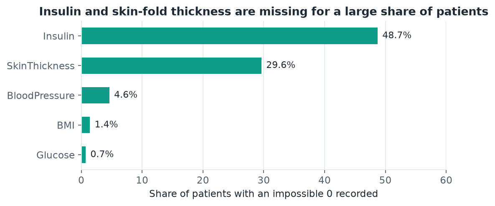
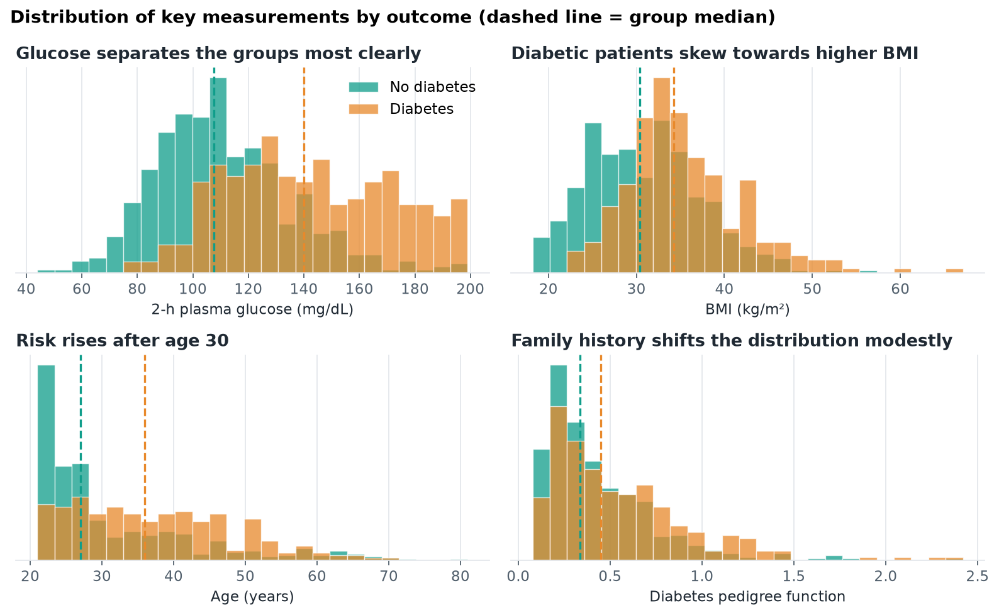
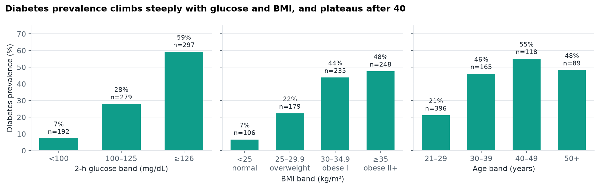
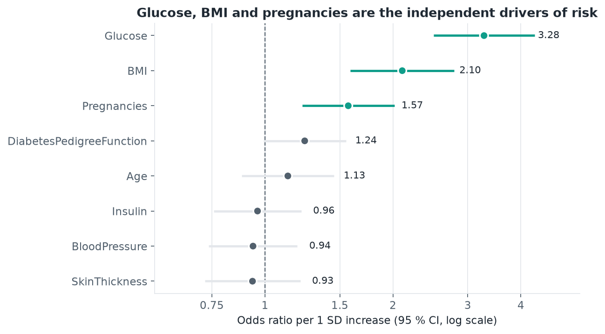
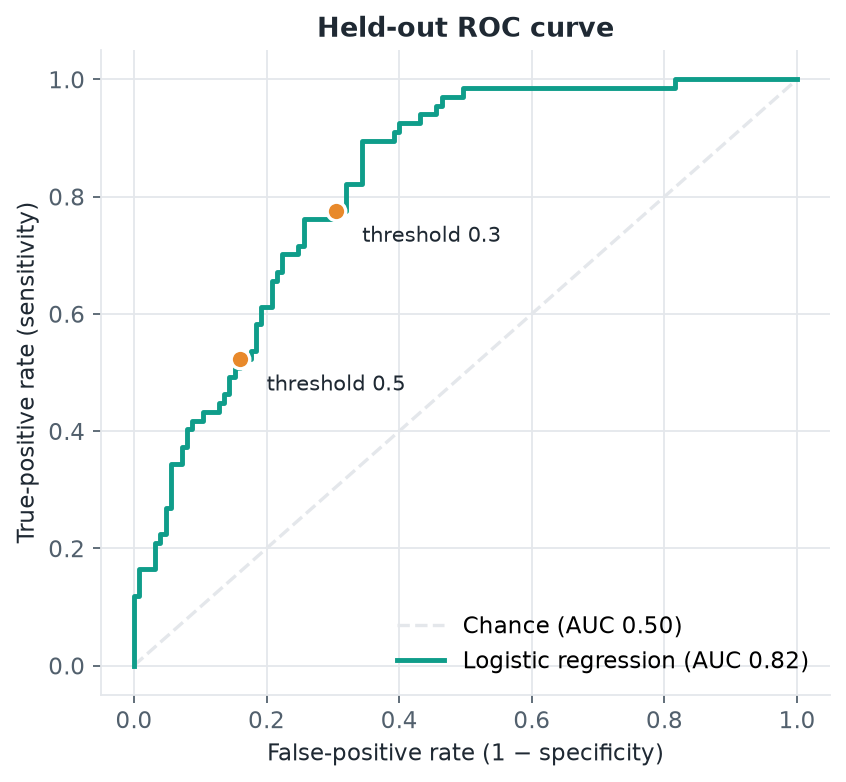
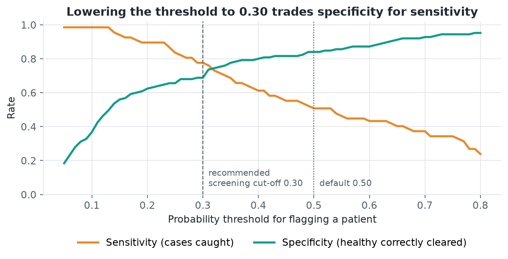
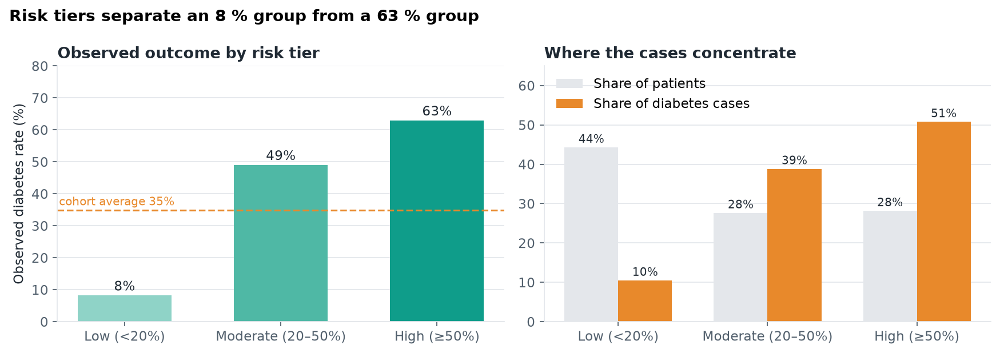

# Project 1 · Diabetes Lab Results Analysis

**Data cleaning, exploratory analysis and an interpretable logistic-regression risk model on the Pima Indians Diabetes dataset, framed as a health-data-analytics problem: who is at risk, how confident are we, and what should a care team do about it.**

| | |
|---|---|
| Notebook | [`diabetes_analysis.ipynb`](diabetes_analysis.ipynb) |
| Slide deck | [`diabetes_lab_results_analysis.pptx`](diabetes_lab_results_analysis.pptx) (10 slides) |
| Data | [`data/diabetes.csv`](data/diabetes.csv) · 768 patients · 8 clinical features · binary outcome |
| Stack | Python 3.11 · pandas · matplotlib · scikit-learn · statsmodels |

---

## 1. The problem

Type 2 diabetes is largely preventable when high-risk patients are identified early and enrolled in prevention programmes, yet the measurements that predict it (glucose, BMI, blood pressure, family history) usually sit in a chart without ever being turned into a risk score.

This project takes a real clinical screening dataset and answers three questions a health-analytics team would be asked:

1. **Are the lab data fit for use?** How much is missing or implausible, and how should it be handled without biasing the analysis?
2. **Which measurements actually separate patients who develop diabetes from those who do not?** Crude associations versus independent effects.
3. **Can a simple, explainable model rank patients into risk tiers a clinic could act on?** And at what threshold should it flag a patient?

### The data

The Pima Indians Diabetes dataset (US National Institute of Diabetes and Digestive and Kidney Diseases) contains 768 women aged 21+ with eight measurements and an outcome flag for a diabetes diagnosis within five years.

| Feature | Clinical meaning |
|---|---|
| `Glucose` | 2-hour plasma glucose in an oral glucose tolerance test (mg/dL) |
| `BMI` | Body mass index (kg/m²) |
| `BloodPressure` | Diastolic blood pressure (mm Hg) |
| `Insulin` | 2-hour serum insulin (mu U/mL) |
| `SkinThickness` | Triceps skin-fold thickness (mm), an adiposity proxy |
| `DiabetesPedigreeFunction` | Score summarising family history of diabetes |
| `Pregnancies`, `Age` | Count of pregnancies; age in years |
| `Outcome` | 1 = diagnosed with diabetes within 5 years (35 % of patients) |

---

## 2. Method

### Data cleaning

The raw file records "not measured" as **0** in five lab columns. A plasma glucose or BMI of zero is not compatible with life, so these are missing values in disguise. Left as numbers they would drag every mean down and teach a model that "BMI = 0" predicts *not* having diabetes.



| Column | Rows with an impossible 0 |
|---|---|
| Insulin | 374 (48.7 %) |
| SkinThickness | 227 (29.6 %) |
| BloodPressure | 35 (4.6 %) |
| BMI | 11 (1.4 %) |
| Glucose | 5 (0.7 %) |

Decisions taken:

* Zeros in those five columns are recoded to missing.
* Rows are **not** dropped. Only 392 of 768 patients are complete cases, and missingness is only weakly related to outcome (insulin missing in 47 % of non-diabetic vs 52 % of diabetic patients), so median imputation is the lower-bias choice.
* Imputation is fitted **inside the model pipeline on training folds only**, so nothing leaks from the test set.
* No duplicate rows exist and no outliers were removed; extreme insulin values are clinically plausible in insulin-resistant patients.

### Exploratory analysis

Distributions by outcome, prevalence across clinically meaningful bands (ADA-style glucose cut-offs, WHO BMI classes, age decades) and a correlation matrix. Charts use a single teal for the non-diabetic group and a warm orange for the diabetic group so that "diabetes" reads as the alert colour throughout.

### Risk model

* Stratified 75 / 25 train–test split (576 / 192 patients); the test set is untouched until final evaluation.
* Pipeline: median imputation → standardisation → L2-regularised logistic regression.
* 5-fold stratified cross-validation for model selection; odds ratios with 95 % confidence intervals from a statsmodels refit on the same standardised design.
* Evaluation on discrimination (ROC / AUC), calibration, and the sensitivity–specificity trade-off across thresholds.
* Patients are then binned into **Low / Moderate / High** risk tiers on predicted probability, and the observed diabetes rate in each tier is reported.

Logistic regression was chosen over tree ensembles deliberately. On 768 rows the AUC gap is small, and a model whose coefficients a clinician can read ("each 30 mg/dL of glucose roughly triples the odds") is far more likely to be adopted.

---

## 3. Findings

### 3.1 Glucose dominates, BMI is the modifiable second driver



The median 2-hour glucose is **140 mg/dL** in patients who developed diabetes versus **107.5 mg/dL** in those who did not. A 2-hour OGTT value of 140–199 mg/dL is the textbook definition of impaired glucose tolerance, so the diabetic group's median sits exactly on the pre-diabetes threshold. BMI shifts by about 4 kg/m² (34.3 vs 30.4). Blood pressure, insulin and skin-fold barely move at the median.

### 3.2 Prevalence follows a clean dose-response



| 2-h glucose | Prevalence | | BMI class | Prevalence | | Age | Prevalence |
|---|---|---|---|---|---|---|---|
| < 100 mg/dL | 7 % | | < 25 (normal) | 7 % | | 21–29 | 21 % |
| 100–125 | 28 % | | 25–29.9 (overweight) | 22 % | | 30–39 | 46 % |
| ≥ 126 | 59 % | | 30–34.9 (obese I) | 44 % | | 40–49 | 55 % |
| | | | ≥ 35 (obese II+) | 48 % | | 50+ | 48 % |

An eight-fold gradient in prevalence from the lowest to the highest glucose band, and a seven-fold gradient across BMI classes. Both are cheap, routine measurements.

### 3.3 Independent effects: what the model says drives risk



Odds ratios per one-standard-deviation increase, adjusted for all other features:

| Feature | 1 SD ≈ | Odds ratio (95 % CI) | Independent effect? |
|---|---|---|---|
| Glucose | 30 mg/dL | **3.28** (2.49–4.31) | Yes, dominant |
| BMI | 6.8 kg/m² | **2.10** (1.59–2.79) | Yes |
| Pregnancies | 3.3 | **1.57** (1.22–2.02) | Yes |
| Pedigree function | 0.33 | 1.24 (0.99–1.55) | Borderline (p ≈ 0.06) |
| Age | 11.9 years | 1.13 (0.88–1.45) | No, once glucose and BMI are known |
| Insulin, blood pressure, skin-fold | | 0.93–0.96, CIs cross 1 | No |

The crude age gradient in 3.2 is almost entirely explained by glucose and BMI rising with age. Age is a proxy, not a driver, which matters when deciding what to screen on.

### 3.4 Model performance

| Metric | Value |
|---|---|
| Cross-validated AUC (5-fold, training set) | 0.831 ± 0.023 |
| Held-out test AUC | 0.824 |
| Brier score | 0.170 (base-rate prediction would score 0.228) |



Calibration is good in the low-risk band (predicted 9 % vs observed 8 %), which is the band a clinic would reassure. The middle bins under-predict and the top bin over-predicts, with only ~20 patients per bin; a deployment would recalibrate on local data before showing probabilities.

### 3.5 Choosing the operating threshold for screening



| Threshold | Patients flagged | Sensitivity | Specificity | Missed cases (of 67) |
|---|---|---|---|---|
| 0.50 (default) | 28 % | 51 % | 84 % | 33 |
| 0.35 | 39 % | 69 % | 78 % | 21 |
| **0.30 (recommended)** | **47 %** | **78 %** | **69 %** | **15** |
| 0.20 | 56 % | 90 % | 62 % | 7 |

For screening, a missed case (undetected progression) costs more than a false alarm (an extra HbA1c and a lifestyle conversation). Moving from 0.50 to 0.30 cuts missed cases by more than half for a 19-point increase in the share of patients flagged.

### 3.6 Patient risk stratification



| Tier | Predicted risk | Share of patients | Observed diabetes rate | Share of all cases | Suggested action |
|---|---|---|---|---|---|
| Low | < 20 % | 44 % | **8 %** | 10 % | Routine care, re-screen in 3 years |
| Moderate | 20–50 % | 28 % | **49 %** | 39 % | Lifestyle counselling, repeat OGTT / HbA1c within 12 months |
| High | ≥ 50 % | 28 % | **63 %** | 51 % | Structured diabetes-prevention programme, confirmatory testing now |

Eight routine measurements separate an 8 % group from a 63 % group. A programme targeting the top two tiers (56 % of patients) would reach **90 % of future cases**.

---

## 4. Clinical relevance and actionable insights

**For care teams**

* **Screen on glucose and BMI first.** They carry almost all of the signal, are cheap, and BMI is modifiable. Age alone is a poor triage criterion once those two are known.
* **Use a 0.30 flag threshold, not 0.50.** Sensitivity rises from 51 % to 78 %; the extra follow-up load is manageable in a population with 35 % prevalence.
* **Act by tier.** Low-tier patients can be safely reassured (8 % observed risk); High-tier patients justify immediate confirmatory testing and referral.

**For data and informatics teams**

* **Fix "0 = not measured" at the source.** It affected five of eight lab columns and half the cohort's insulin values. Storing nulls explicitly is a cheap change that protects every downstream analysis.
* **Monitor per-feature missingness in production.** The pipeline tolerates a missing insulin value, but a drift in what gets measured would silently degrade the score.
* **Recalibrate locally before showing probabilities.** Discrimination transfers across populations better than calibration does.

## 5. Limitations

* Single-study cohort of Pima women; coefficients will not transfer unchanged to a general population. The method transfers, the numbers need local refitting.
* 768 patients (192 in the test set) give wide confidence intervals on calibration and on the weaker predictors.
* The outcome is a five-year diagnosis, so this is a prognostic score rather than a diagnostic test.
* Missingness in insulin and skin-fold was treated as uninformative after checking it was only weakly related to outcome; a missing-indicator sensitivity analysis would strengthen that assumption.

## 6. Reproducing the analysis

```bash
pip install pandas numpy matplotlib scikit-learn statsmodels jupyter
jupyter nbconvert --to notebook --execute --inplace diabetes_analysis.ipynb
```

All figures in `figures/` are regenerated by the notebook. The dataset is the public Pima Indians Diabetes file (UCI / Kaggle) with a header row added.

## Project structure

```
01-diabetes-python/
├── README.md
├── diabetes_analysis.ipynb          # cleaning → EDA → model → risk tiers
├── diabetes_lab_results_analysis.pptx
├── data/
│   └── diabetes.csv
└── figures/
    ├── 01_missing_zeros.png
    ├── 02_outcome_balance.png
    ├── 03_distributions_by_outcome.png
    ├── 04_prevalence_by_band.png
    ├── 05_correlation_heatmap.png
    ├── 06_roc_curve.png
    ├── 07_odds_ratios.png
    ├── 08_threshold_tradeoff.png
    ├── 09_calibration.png
    └── 10_risk_tiers.png
```
