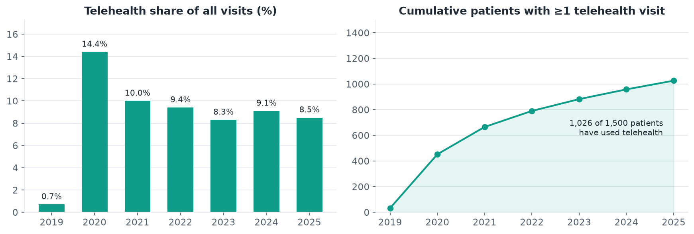
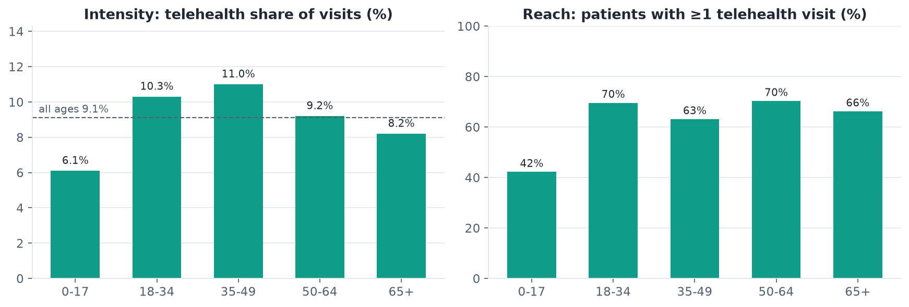
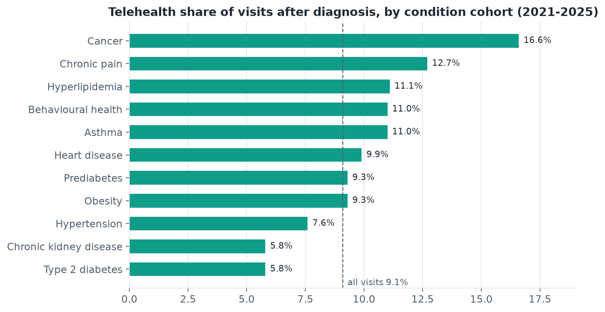
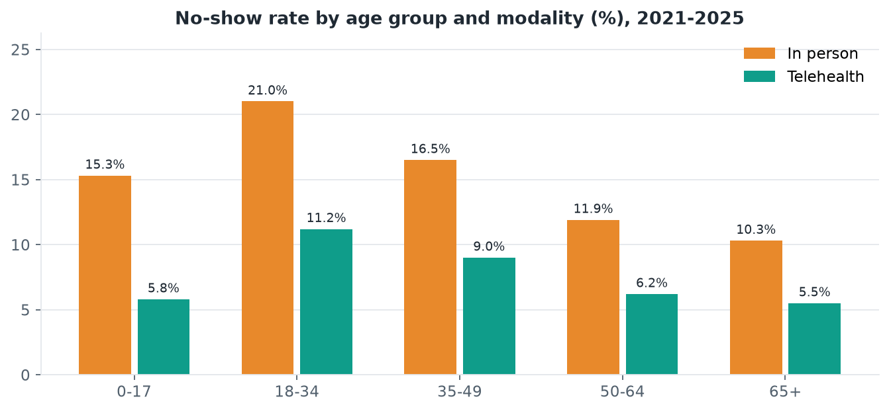
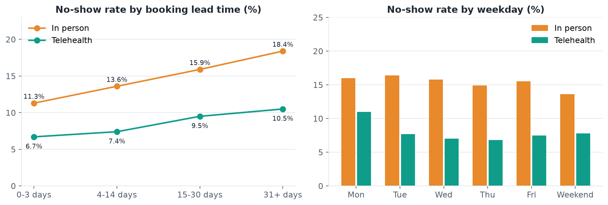
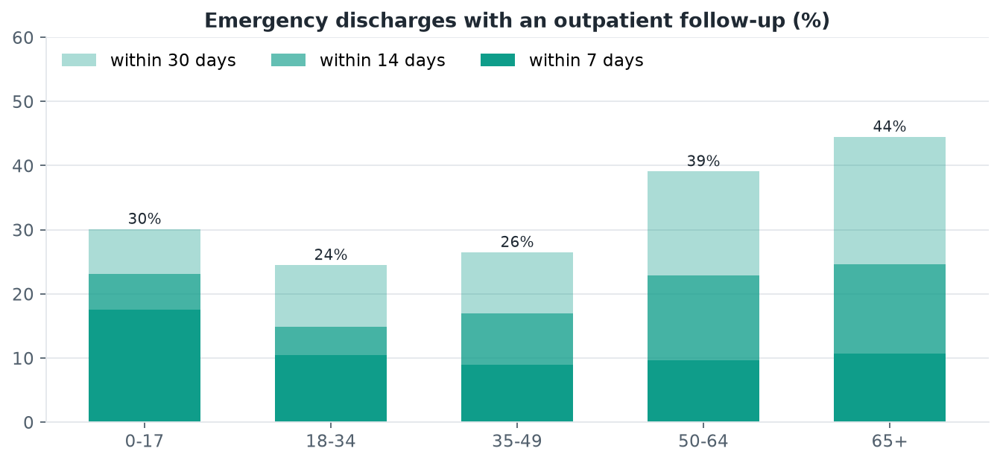
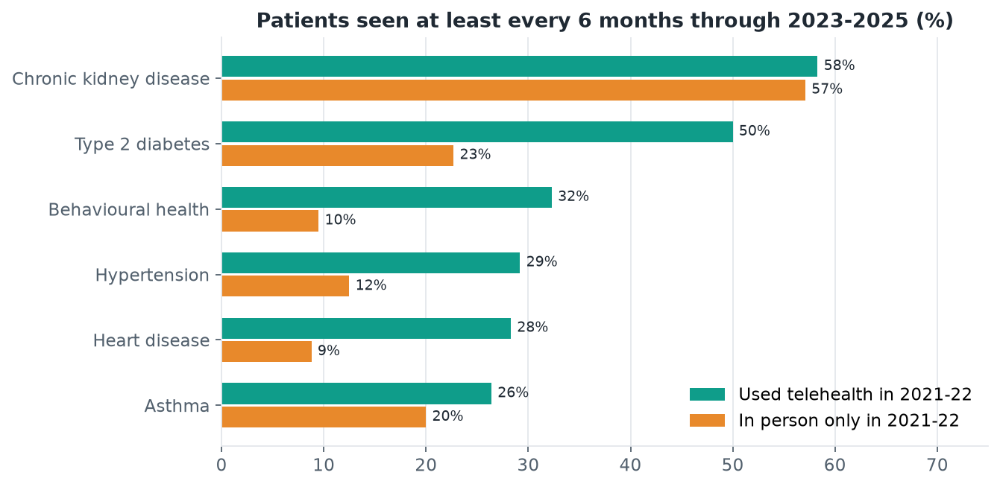
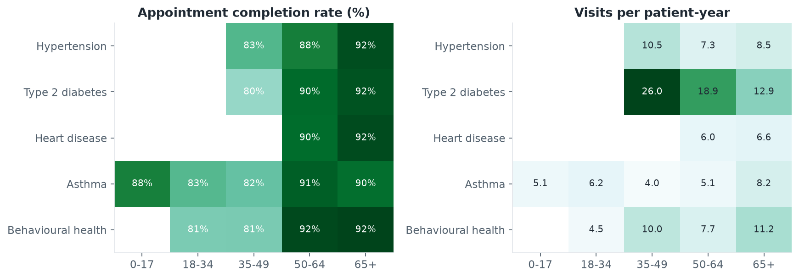
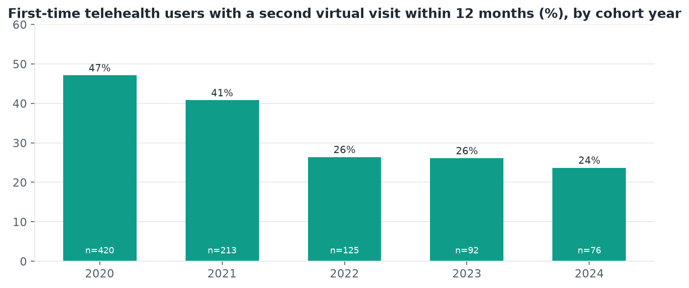

# Project 2 · Telehealth & Patient Engagement Analysis

**A SQL-first analysis of how a primary-care population adopted telehealth, whether virtual visits reduce no-shows, and how well patients are followed up after acute care and in chronic-disease management. Built on a Synthea synthetic EHR loaded into SQLite, and framed the way a digital-health analytics team would frame it: what changed, for whom, and which lever to pull next.**

| | |
|---|---|
| Database | [`telehealth.db`](telehealth.db) · SQLite · 8 tables, 2 views · schema in [`sql/schema.sql`](sql/schema.sql) |
| Queries | [`sql/queries/`](sql/queries/) · 10 analytical queries using joins, CTEs and window functions |
| Notebook | [`telehealth_engagement_analysis.ipynb`](telehealth_engagement_analysis.ipynb) · runs every query and charts the key results |
| Slide deck | [`telehealth_patient_engagement.pptx`](telehealth_patient_engagement.pptx) (10 slides) |
| Data | [`data/raw/`](data/raw/) · Synthea CSV export, 1,500 patients, Massachusetts, 2019-2025 |
| Build | [`build_database.py`](build_database.py) · rebuilds the database from the raw CSVs in ~15 s |
| Stack | SQLite 3.45 · Python 3.11 · pandas · matplotlib · Synthea 3.x |

---

## 1. The problem

Telehealth went from a niche service to a standard channel in a matter of weeks in 2020. Five years on, health systems are asking harder questions than "how many video visits did we do":

1. **Adoption.** Where has telehealth settled as a share of care, and is that share the same for a 25-year-old with anxiety as for a 70-year-old with heart failure?
2. **Access and reliability.** Missed appointments waste clinical capacity and delay care. Do virtual visits actually get missed less often, and for whom?
3. **Follow-up adherence.** Two of the most-watched care-quality measures are follow-up after an emergency or inpatient discharge and regular review of chronic conditions. Where are the gaps, and is the virtual channel closing them or widening them?
4. **Engagement.** Which age groups and condition cohorts are engaged, which are not, and do first-time telehealth users stick with it?

Every one of those questions is a query over four core clinical tables (patients, encounters, conditions, medications) plus a scheduling table, which is exactly the shape of a real EHR data warehouse. That is why this project is SQL-first: the analysis is written as reusable queries, and the notebook is a thin runner that charts the output.

### The data

There is no public, patient-level EHR with telehealth visits and no-shows, so the dataset is synthetic. It comes from **[Synthea](https://github.com/synthetichealth/synthea)**, the open-source synthetic patient generator, run for 1,500 living patients in Massachusetts with a seven-year study window (2019-2025). Synthea produces realistic longitudinal records: demographics, encounters with SNOMED-coded visit types and reasons, a problem list with onset and resolution dates, medications with dispense counts, providers, organisations and payers.

Two things Synthea does not model well were added on top, with the parameters kept in one place ([`build_database.py`](build_database.py)) so the assumptions can be audited or changed:

| Layer | Why it was needed | How it works |
|---|---|---|
| **Visit modality** (`encounters.modality`) | Synthea tags well under 1 % of visits as virtual, far below the 10-20 % of ambulatory care that has been delivered by telehealth in the US since 2021 | Each *eligible* visit (problem, follow-up, symptom, check-up, consultation; never procedures, immunisations, prenatal care, dialysis, dental care, injuries, emergency or inpatient stays) is switched to telehealth with a probability driven by calendar year (near zero before March 2020, a spike in 2020, settling at a third of eligible visits), age band, visit reason (behavioural health and chronic-disease review lean virtual) and a per-patient propensity so use clusters in repeat users |
| **Appointments** (`appointments` table) | Synthea has no notion of a booking or a missed appointment | Every scheduled-type encounter becomes a completed appointment with a booking lead time. Missed and cancelled bookings are then generated with probabilities driven by modality, age band, lead time, weekday, visit reason and a per-patient reliability effect |

Both layers are seeded, so the database is reproducible. Nothing in the clinical record (diagnoses, medications, visit dates, costs) is altered, and Synthea's direct identifiers (names, SSN, street address) are dropped at load time even though they are synthetic. The findings below are therefore findings about a *plausible* population; the method transfers to a real one unchanged, the numbers do not.

### The schema

```
patients ──< encounters ──< conditions          v_patient_chronic   (patient x chronic-condition bucket, first onset)
    │            │      └─< medications          v_encounter_demo    (encounters joined to demographics + visit year)
    │            ├──── providers ── organizations
    │            └──── payers
    └────────< appointments >── encounters (completed bookings only)
```

| Table | Rows | Grain and key columns |
|---|---|---|
| `patients` | 1,500 | One row per patient: birth date, gender, race, ethnicity, income, `age_years` and `age_group` at 2025-12-31 |
| `encounters` | 46,524 | One row per visit: start/stop, `encounter_class` (ambulatory, wellness, emergency, inpatient, ...), **`modality`** (telehealth / in_person), SNOMED visit type and reason, costs |
| `conditions` | 39,015 | Problem-list entries with onset/resolution and an analyst-assigned **`condition_group`** (Hypertension, Type 2 diabetes, Behavioural health, ...) |
| `medications` | 37,882 | Prescriptions with dispense counts and the condition they treat |
| `appointments` | 52,821 | Bookings: `scheduled_date`, `booked_date`, `lead_days`, `modality`, **`status`** (completed / no_show / cancelled) |
| `providers`, `organizations`, `payers` | 774 / 779 / 10 | Lookup tables |

---

## 2. Method

### The ten queries

Each query is a self-contained file with a header explaining the question and the SQL techniques used. They are written against SQLite but use only standard SQL (CTEs, window functions, conditional aggregation), so they port to Postgres or BigQuery with trivial changes.

| # | File | Question | Techniques |
|---|---|---|---|
| 1 | `01_telehealth_adoption_by_year` | How did telehealth share and the user base evolve? | CTEs, `LAG()`, running `SUM() OVER (ORDER BY)` |
| 2 | `02_adoption_by_age_group` | Intensity vs reach of telehealth by age band | `SUM() OVER ()` benchmark, `RANK()` |
| 3 | `03_telehealth_by_condition` | Telehealth share within chronic-condition cohorts | View-based cohort, date-conditioned join, `CROSS JOIN` benchmark, `DENSE_RANK()` |
| 4 | `04_visit_reasons_by_modality` | What is telehealth used for? | `ROW_NUMBER()` top-N per partition, `SUM() OVER (PARTITION BY)` |
| 5 | `05_no_show_rates` | No-show and cancellation by age x modality vs three benchmarks | Conditional aggregation, `SUM() OVER (PARTITION BY ...)` |
| 6 | `06_no_show_drivers` | Lead time, weekday, visit category as no-show drivers | `UNION ALL` unpivot, `RANK() OVER (PARTITION BY driver)` |
| 7 | `07_post_acute_followup` | Follow-up within 7/14/30 days of an ED or inpatient discharge | Self-join, `ROW_NUMBER()` first-event, `LEFT JOIN` to keep non-events |
| 8 | `08_chronic_care_cadence` | Are chronic patients seen every six months? | `LAG()` visit gaps, prior-period exposure, `LEFT JOIN` cohort |
| 9 | `09_engagement_by_age_and_condition` | Engagement mix per age x condition cell | Patient-level features from three tables, `NTILE(4)` quartiles |
| 10 | `10_telehealth_persistence` | Do first-time telehealth users return? | `ROW_NUMBER()` first visit, `LEAD()` next visit, 12-month cohorts |

### Definitions

* **Telehealth share** = virtual visits / all visits. Because roughly three-quarters of visits (physicals, immunisations, procedures, dialysis, pregnancy, emergency) can never be virtual, a share of ~9 % of *all* visits corresponds to about a third of *eligible* visits.
* **No-show rate** = no_show / (completed + no_show + cancelled) bookings.
* **Post-discharge follow-up** = first ambulatory, outpatient, wellness or virtual visit after the discharge timestamp of an emergency or inpatient encounter.
* **Six-month cadence** = at least six scheduled-type visits in 2023-2025 with no gap longer than 200 days.
* **Engagement quartile** = `NTILE(4)` over visits per patient-year across all patients with an established chronic condition.
* Steady-state comparisons use **2021-2025**, after the 2020 spike.

---

## 3. Findings

### 3.1 Telehealth settled at one visit in eleven, and two-thirds of patients have used it



| Year | Visits | Telehealth share | New telehealth users | Cumulative users |
|---|---|---|---|---|
| 2019 | 5,726 | 0.7 % | 32 | 32 |
| 2020 | 5,763 | **14.4 %** | 420 | 452 |
| 2021 | 7,748 | 10.0 % | 213 | 665 |
| 2022 | 6,501 | 9.4 % | 125 | 790 |
| 2023 | 6,715 | 8.3 % | 92 | 882 |
| 2024 | 7,031 | 9.1 % | 76 | 958 |
| 2025 | 7,040 | 8.5 % | 68 | 1,026 |

The 2020 spike gave way to a plateau of 8-10 % of all visits. The user base kept growing after the spike, but at a slowing rate, and by 2025 1,026 of 1,500 patients (68 %) had at least one virtual visit. Growth from here comes from repeat use, not first use (3.7).

### 3.2 Reach is flat across adult ages; intensity peaks in working-age adults



| Age group | Telehealth share of visits | Patients with ≥1 telehealth visit |
|---|---|---|
| 0-17 | 6.1 % | 42 % |
| 18-34 | 10.3 % | 70 % |
| 35-49 | **11.0 %** | 63 % |
| 50-64 | 9.2 % | 70 % |
| 65+ | 8.2 % | 66 % |

Two different measures tell two different stories. **Reach** is essentially flat from 18 upwards: two-thirds of patients in every adult band, including 65+, have used telehealth. **Intensity** peaks at 35-49 and is lowest for children, whose care is dominated by well-child checks and immunisations. Older adults use telehealth less often per visit, not less at all. That is a design problem about which of their visits are offered virtually, not an adoption problem.

### 3.3 Behavioural health, cancer and chronic pain lean virtual; diabetes and kidney disease are diluted by hands-on care



| Condition cohort | Patients | Telehealth share | Patients who used telehealth | Visits per patient |
|---|---|---|---|---|
| Cancer | 43 | **16.6 %** | 91 % | 33 |
| Chronic pain | 385 | 12.7 % | 74 % | 26 |
| Hyperlipidemia | 126 | 11.1 % | 90 % | 36 |
| Behavioural health | 152 | 11.0 % | 69 % | 32 |
| Asthma | 88 | 11.0 % | 86 % | 33 |
| Heart disease | 210 | 9.9 % | 69 % | 33 |
| Hypertension | 283 | 7.6 % | 72 % | 43 |
| Chronic kidney disease | 95 | 5.8 % | 80 % | **100** |
| Type 2 diabetes | 138 | 5.8 % | 74 % | 76 |

Cohorts whose care is mostly medication review and symptom check-ins sit above the population average. Type 2 diabetes and chronic kidney disease sit well below it even though three-quarters of those patients have used telehealth, because their visit volume is dominated by dialysis, foot and eye checks and lab draws. The right KPI for those cohorts is telehealth share of *eligible* visits.

The top virtual-visit reasons (query 4) are medication-assisted treatment for substance use (15 % of virtual visits), routine check-ups, lipid management, contraception and minor acute illness. In-person volume is led by physicals, dialysis, well-child care, pregnancy and immunisations.

### 3.4 Virtual visits halve the no-show rate, and long lead times are the biggest operational risk



| Age group | In-person no-show | Telehealth no-show | Gap |
|---|---|---|---|
| 0-17 | 15.3 % | 5.8 % | 9.5 pts |
| 18-34 | **21.0 %** | 11.2 % | 9.8 pts |
| 35-49 | 16.5 % | 9.0 % | 7.5 pts |
| 50-64 | 11.9 % | 6.2 % | 5.7 pts |
| 65+ | 10.3 % | 5.5 % | 4.8 pts |
| **All** | **15.1 %** | **8.0 %** | 7.1 pts |



Telehealth's advantage holds in every age band and is widest where in-person no-shows are worst: young adults miss one in five in-person bookings but one in nine virtual ones. Booking lead time is the strongest lever: in-person bookings made 31+ days out are missed 18.4 % of the time against 11.3 % for same-week slots, and the telehealth gradient is much flatter (6.7 % to 10.5 %). Weekday adds almost nothing once lead time is accounted for. Cancellations run at a flat 5 % regardless of modality.

### 3.5 Fewer than half of emergency discharges get outpatient follow-up within 30 days



| Emergency discharges | 7 days | 14 days | 30 days | Telehealth share of 30-day follow-ups |
|---|---|---|---|---|
| 0-17 | 17.5 % | 23.1 % | 30.1 % | 19 % |
| 18-34 | 10.5 % | 14.9 % | **24.5 %** | 38 % |
| 35-49 | 9.0 % | 17.0 % | 26.5 % | 21 % |
| 50-64 | 9.6 % | 22.9 % | 39.1 % | 19 % |
| 65+ | 10.7 % | 24.6 % | **44.5 %** | 11 % |

Only about one in ten emergency discharges is followed by an outpatient contact within a week, and the 30-day rate ranges from a quarter (18-49) to 45 % (65+). Inpatient discharges look similar (25-44 %). Where follow-up does happen in the working-age bands, telehealth already delivers a fifth to over a third of it, which makes a scheduled virtual check-in within seven days of discharge the obvious closing move.

### 3.6 Prior telehealth users are two to three times more likely to stay on a chronic-care cadence



| Condition | In-person only (2021-22) | Used telehealth (2021-22) |
|---|---|---|
| Type 2 diabetes | 23 % | **50 %** |
| Behavioural health | 10 % | **32 %** |
| Hypertension | 12 % | **29 %** |
| Heart disease | 9 % | **28 %** |
| Asthma | 20 % | 26 % |
| Chronic kidney disease | 57 % | 58 % |

Share of patients seen at least every six months through 2023-2025. Exposure is measured in the *prior* two years so it precedes the outcome, but this is still an association, not a treatment effect: frequent attenders are more likely to have tried telehealth. What it does establish is that the in-person-only chronic cohort is where the follow-up gaps are, and that the virtual channel is where the engaged patients already are. Kidney disease is the exception because dialysis fixes the cadence regardless of channel.

### 3.7 Engagement rises with age; second-visit conversion has fallen with each cohort



Across every condition, appointment completion climbs from about 80 % in patients under 35 to over 90 % at 65+. Young adults with behavioural-health or asthma diagnoses are the least engaged cells on both completion and visit frequency, and also the cells with the highest telehealth share, which makes them the natural pilot population for a virtual-first pathway.



| First telehealth visit in | First-time users | Second virtual visit within 12 months | Telehealth share of their next 12 months of visits |
|---|---|---|---|
| 2020 | 420 | **47 %** | 18 % |
| 2021 | 213 | 41 % | 17 % |
| 2022 | 125 | 26 % | 14 % |
| 2023 | 92 | 26 % | 12 % |
| 2024 | 76 | 24 % | 15 % |

Almost half of the 2020 first-timers came back for a second virtual visit within a year; only a quarter of those who started in 2022 or later did. Early adopters were pushed by necessity and tended to be regular attenders; later first-timers try telehealth once for a minor complaint and drift back to in-person care.

---

## 4. What a digital health team should do with this

**For operations and access teams**

* **Offer a virtual slot to any in-person booking more than two weeks out, starting with under-35s.** That is the segment where in-person no-shows exceed 20 % and where telehealth roughly halves them. Even a modest conversion rate recovers meaningful clinic capacity.
* **Book the second virtual visit before the first one ends.** Second-visit conversion has dropped to a quarter; a scheduled follow-up at the point of care is the cheapest retention intervention there is.
* **Stop treating 65+ as non-adopters.** Two-thirds have used telehealth. The gap is in which of their visits are offered virtually, so target medication reviews and chronic-condition check-ins rather than pushing video for everything.

**For quality and population-health teams**

* **Stand up a 7-day virtual post-discharge check-in.** Fewer than 45 % of emergency discharges see a clinician within 30 days and only 10 % within a week; the 18-49 band is worst. This is the measure most likely to move with a virtual pathway because the barrier is logistics, not clinical need.
* **Run outreach on the in-person-only chronic cohort.** Hypertension, heart-disease and behavioural-health patients who never used telehealth are on a six-month cadence only 9-12 % of the time. Offering a virtual review is a low-cost way to re-engage them.
* **Report telehealth share per condition on *eligible* visits**, not on all visits. Otherwise diabetes and kidney-disease programmes look like laggards when their patients are among the heaviest telehealth users.

**For data and informatics teams**

* **Capture modality as a first-class field on every encounter** and keep no-shows and cancellations as rows in a scheduling table with booking lead time. Every query here depends on those two fields; neither is standard in most EHR extracts.
* **Ship the ten queries as views or scheduled jobs.** They are standard SQL and run in well under a second on this database; the same code becomes a telehealth dashboard on a real warehouse.

## 5. Limitations

* **Synthetic population.** Synthea's clinical record is realistic but not real, and the modality and scheduling layers are simulations calibrated to published US telehealth and no-show rates. The *patterns* (lead-time gradient, age gradient, virtual advantage) are built in by design; the *interactions* between them and the clinical record (which conditions, which follow-ups, which cohorts) are what the queries surface. Treat the numbers as illustrative and the method as reusable.
* **No causal claims.** The chronic-cadence comparison is confounded by baseline utilisation. A real evaluation would match on prior visit frequency or use a difference-in-differences design around a telehealth rollout.
* **Single state, single generator seed.** 1,500 patients give small cells for rarer conditions (cancer, COPD) and for inpatient discharges by age; cells under 10-20 patients are suppressed in queries 7 and 9.
* **Provider specialty is not modelled.** Synthea assigns every encounter to a general-practice provider, so specialty-level telehealth analysis is out of scope.

## 6. Reproducing the analysis

```bash
pip install pandas numpy matplotlib jupyter
python build_database.py                       # rebuilds telehealth.db from data/raw/*.csv.gz (~15 s)
jupyter nbconvert --to notebook --execute --inplace telehealth_engagement_analysis.ipynb
```

To regenerate the raw data from scratch with Synthea (Java 11+):

```bash
java -jar synthea-with-dependencies.jar -p 1500 -s 42 -cs 42 -r 20251231 \
  --exporter.csv.export=true --exporter.fhir.export=false \
  --exporter.csv.included_files=patients.csv,encounters.csv,conditions.csv,medications.csv,providers.csv,organizations.csv,payers.csv \
  --exporter.years_of_history=8 --generate.only_alive_patients=true Massachusetts
```

then drop the identifier columns and gzip the CSVs into `data/raw/` (the exact column list is in `build_database.py`).

Any SQL client can open `telehealth.db` directly; the queries in `sql/queries/` run unchanged in the SQLite CLI, DBeaver or DB Browser for SQLite.

## Project structure

```
02-telehealth-sql/
├── README.md
├── build_database.py                       # CSV → SQLite, modality + scheduling simulation layers
├── telehealth.db                           # SQLite database (26 MB)
├── telehealth_engagement_analysis.ipynb    # runs the 10 queries and charts the results
├── telehealth_patient_engagement.pptx      # 10-slide deck
├── sql/
│   ├── schema.sql                          # tables, indexes, views
│   └── queries/
│       ├── 01_telehealth_adoption_by_year.sql
│       ├── 02_adoption_by_age_group.sql
│       ├── 03_telehealth_by_condition.sql
│       ├── 04_visit_reasons_by_modality.sql
│       ├── 05_no_show_rates.sql
│       ├── 06_no_show_drivers.sql
│       ├── 07_post_acute_followup.sql
│       ├── 08_chronic_care_cadence.sql
│       ├── 09_engagement_by_age_and_condition.sql
│       └── 10_telehealth_persistence.sql
├── data/raw/                               # Synthea CSV export, identifiers removed, gzipped
│   ├── patients.csv.gz · encounters.csv.gz · conditions.csv.gz · medications.csv.gz
│   └── providers.csv.gz · organizations.csv.gz · payers.csv.gz
└── figures/                                # regenerated by the notebook
    ├── 01_adoption_by_year.png … 09_persistence.png
```
