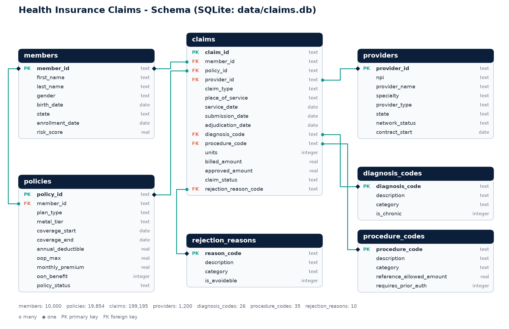
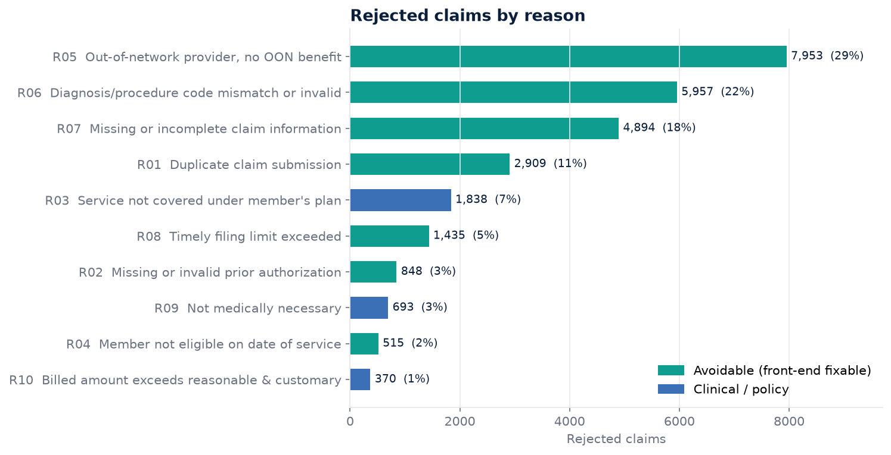
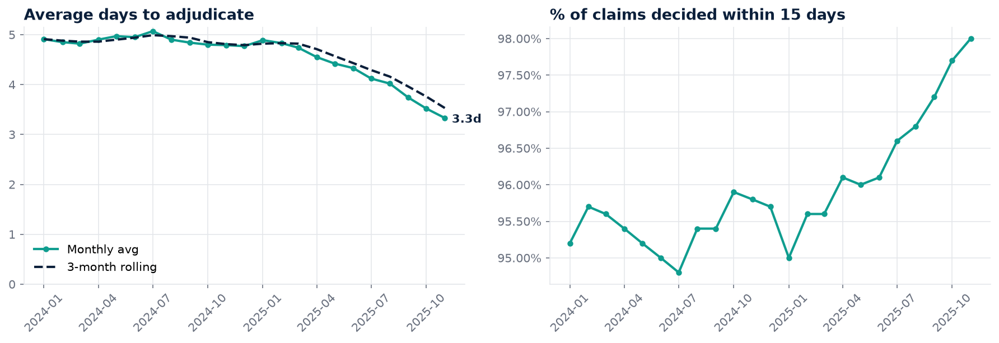
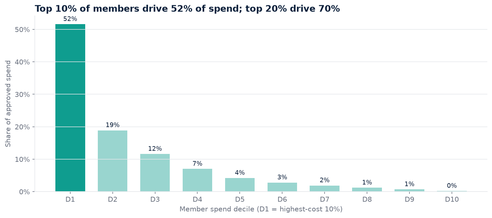
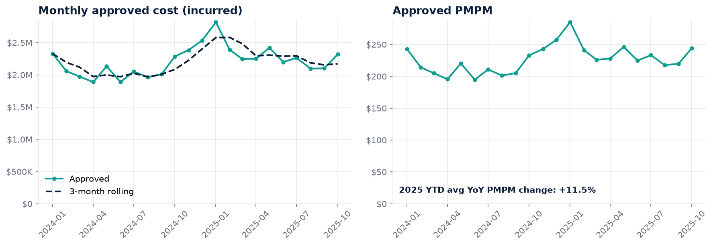
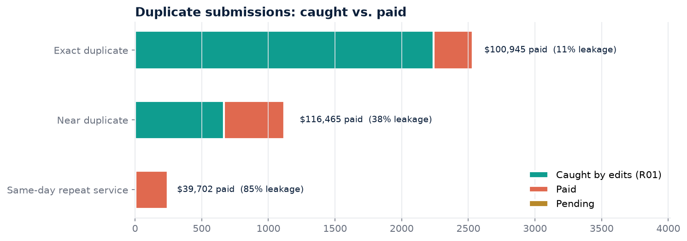
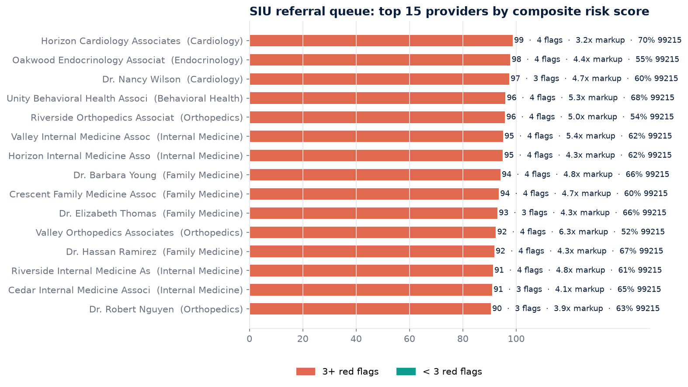

# 05 · Health Insurance Claims & Fraud Signals Analysis

> SQL-first analysis of **199,195 synthetic health insurance claims** (Jan 2024 – Dec 2025) from a payer's point of view:
> how efficiently claims are adjudicated, where medical cost is concentrated, and where payment integrity is leaking dollars.

**Stack:** SQLite · SQL (CTEs, joins, window functions) · Python (pandas, matplotlib, Jupyter) · pptxgenjs

| Deliverable | Path |
|---|---|
| SQLite database (7 tables) | [`data/claims.db`](data/claims.db) |
| Schema DDL + ER diagram | [`sql/00_schema.sql`](sql/00_schema.sql) · [`images/schema_diagram.png`](images/schema_diagram.png) |
| 12 analytical queries | [`sql/01_…` – `sql/12_…`](sql/) |
| Notebook that runs every query and charts it | [`notebooks/claims_analysis.ipynb`](notebooks/claims_analysis.ipynb) |
| 10-slide executive deck | [`presentation/insurance_claims_fraud_signals.pptx`](presentation/insurance_claims_fraud_signals.pptx) |
| Data generator / diagram / notebook / deck builders | [`scripts/`](scripts/) · [`presentation/build_deck.js`](presentation/build_deck.js) |

---

## Why this matters to a health plan

A payer's claims operation is judged on three things, and every query in this project maps to one of them:

| Lens | The question a plan leader asks | Queries |
|---|---|---|
| **Payer efficiency** | *Are we paying the right claims quickly, and denying only what we must?* Denials create rework for providers, call volume for members, and appeal costs for the plan. Slow adjudication risks prompt-pay penalties. | 01, 02, 03, 05, 06 |
| **Cost containment** | *Which conditions and members drive spend, and is our trend under control?* Cost is highly concentrated, so targeting matters more than blanket programmes. | 04, 07, 08, 12 |
| **Claims integrity** | *Are we paying for things that shouldn't be paid?* Fraud, waste & abuse (FWA) typically runs to several % of spend: duplicates, upcoding, inflated charges. | 09, 10, 11 |

---

## Data model



| Table | Rows | Grain / notes |
|---|---:|---|
| `claims` | 199,195 | One claim line: ICD-10 diagnosis, CPT/HCPCS procedure, units, billed vs approved, status (`Approved` / `Rejected` / `Pending`), rejection reason, service / submission / adjudication dates |
| `members` | 10,000 | Demographics, state, enrollment date, relative risk score |
| `policies` | 19,854 | Annual coverage segment per member: plan type (HMO/PPO/EPO/HDHP), metal tier, deductible, OOP max, premium, OON benefit flag, terminations |
| `providers` | 1,200 | NPI, specialty (18), provider type, state, network status |
| `diagnosis_codes` | 26 | ICD-10-CM lookup with category and chronic flag |
| `procedure_codes` | 35 | CPT/HCPCS lookup with reference allowed amount and prior-auth flag |
| `rejection_reasons` | 10 | Denial reasons with category and *avoidable* flag |

`approved_amount` is the plan's allowed amount (capped at billed); it is `0` for rejected and `NULL` for pending claims.

<details>
<summary>What was deliberately built into the synthetic data</summary>

The generator ([`scripts/generate_data.py`](scripts/generate_data.py), seeded, about 1 minute to run) embeds realistic patterns so the SQL has something real to find:

- Winter respiratory seasonality and a ~6% annual unit-cost trend
- Provider-specific coding-error rates, so denial rates differ between providers
- HMO/EPO members seeing out-of-network providers (no OON benefit), plus missing prior auth on imaging and surgery
- Members terminated mid-2025 and still receiving services (eligibility denials); a long tail of late submissions (timely filing)
- Duplicate resubmissions (exact and billed-amount-tweaked), mostly caught but not all
- A hidden cohort of 24 "suspicious" providers with extreme markups, upcoding to 99215 and more duplicates
- Billed-amount outliers at 5–15x typical charges
- Adjudication turnaround that improves through 2025 (auto-adjudication rollout)
</details>

---

## The 12 queries

| # | File | Question | SQL techniques |
|---|---|---|---|
| 01 | `01_rejection_rate_by_provider.sql` | Which providers sit furthest above their specialty's rejection rate? | CTE, JOIN, `SUM() OVER (PARTITION BY)`, `RANK()` |
| 02 | `02_rejection_reasons.sql` | Which denial reasons drive volume and dollars, and how many are avoidable? | LEFT JOIN, share-of-total `SUM() OVER ()`, running cumulative % |
| 03 | `03_rejection_reason_by_specialty.sql` | What's the denial mix per specialty, and each one's top driver? | Conditional-aggregation pivot, `ROW_NUMBER()` top-1 |
| 04 | `04_avg_cost_by_diagnosis.sql` | Mean vs median approved cost per diagnosis | `ROW_NUMBER()` + `COUNT()` window **median**, `MATERIALIZED` CTEs |
| 05 | `05_approval_turnaround.sql` | How long does adjudication take by path and outcome? | `julianday()` date math, window median / P90, SLA % |
| 06 | `06_turnaround_trend_and_backlog.sql` | Is turnaround improving month to month? | `LAG()`, 3-month rolling `AVG() OVER (ROWS …)` |
| 07 | `07_high_cost_members.sql` | Who are the top-1% cost members and what conditions do they have? | `NTILE(100)`, `GROUP_CONCAT`, latest-policy `ROW_NUMBER()` |
| 08 | `08_cost_concentration.sql` | How concentrated is spend (Pareto)? | `NTILE(10)`, cumulative `SUM() OVER (ORDER BY)` |
| 09 | `09_duplicate_claims.sql` | How many duplicates are submitted, caught, and paid? | `COUNT/ROW_NUMBER/FIRST_VALUE` over a duplicate key, named `WINDOW` |
| 10 | `10_billed_amount_outliers.sql` | Which claims bill far outside the norm for their procedure? | Window mean/variance z-test (no `SQRT` needed), window median |
| 11 | `11_provider_fraud_risk_score.sql` | Which providers combine several FWA signals? | 4 CTEs, `PERCENT_RANK()` within specialty, weighted composite score |
| 12 | `12_mom_cost_trends.sql` | What are the monthly cost, PMPM, MoM and YoY trends? | `WITH RECURSIVE` month calendar, member-months join, `LAG(1)`, `LAG(12)` |

Run any of them directly:

```bash
sqlite3 -header -column data/claims.db < sql/02_rejection_reasons.sql
```

---

## Key findings

### 1 · Payer efficiency

**Initial rejection rate is 13.8% (27,412 claims), and 89% of those denials were avoidable.**



- **Out-of-network with no OON benefit (29%)**, **coding mismatches (22%)** and **missing information (18%)** make up 69% of all denials. A clean front-end submission would have prevented them.
- **The provider ranking is really a network story.** All 25 providers furthest above their specialty rate (Q01) are *out-of-network* and treating HMO/EPO members. The fix is member steering, referral management and directory accuracy, not provider education.
- **Specialty patterns differ (Q03).** Prior auth drives 35% of General Surgery and 31% of Oncology denials. Coding is the top driver in Cardiology, Behavioral Health, Neurology and Nephrology.
- Only 3 of the 10 reasons (not covered, not medically necessary, reasonable & customary review) are genuine clinical or policy decisions.

**Turnaround:** auto-adjudicated claims are decided in a median of **3 days**, and manual-review claims (prior-auth procedures or > $2,500) in **15 days**. Only 53% of manual-review claims meet a 15-day target. The 2025 automation push cut the overall average from **4.9 to 3.3 days**, and 98% of claims are now decided within 15 days (Q05, Q06).



### 2 · Cost containment

**The top 10% of members account for 52% of approved spend, and the top 20% for 70% (Q08).**



- The 50 highest-cost members (Q07) are older (median age 63) and multi-morbid (median 5 chronic diagnoses). Circulatory, endocrine and musculoskeletal conditions dominate. These are the natural candidates for case and disease management, and they are the stop-loss exposure.
- **Cost per claim (Q04)** is highest for delivery ($2.6K), gallstones ($1.6K), breast cancer, tibia fracture and knee osteoarthritis. For gallstones, tibia fracture, knee osteoarthritis and coronary artery disease the mean is 2.5–7x the median, which means a few surgical episodes drive the cost. The levers are site-of-care and prior auth, not unit price.
- **Trend (Q12):** approved PMPM rose from about $219 (2024 average) to about $237 (Jan–Oct 2025), and YoY PMPM change was +11.5% on average in 2025. It peaks every January (respiratory season). The latest months exclude claims still in run-out.



### 3 · Claims integrity (fraud, waste & abuse signals)

- **Duplicates (Q09):** 3,796 exact or near-duplicate resubmissions. The duplicate edit catches 86% of **exact** copies but only 55% of **near** duplicates, where the billed amount was nudged by 1–3%. The result is **38% leakage vs 11%**, and **$217K paid on duplicates**, which is recoverable. Adding a ±5% tolerance band to the edit is a quick win. The 285 *same-day repeat services* are usually legitimate and belong in post-pay review.

  

- **Outliers (Q10):** 985 claims bill more than 3σ above their procedure mean *and* at least 3x its median ($6.7M billed). Because allowed amounts are capped by the fee schedule, approved outliers were paid only about $111K. The concentration of outliers in E&M codes at a handful of providers is itself a behavioural signal.
- **Provider scorecard (Q11):** a 0–100 composite of five peer-relative signals (markup, 99215 share, duplicate rate, outlier rate, claims per member) surfaces **20 providers with 3+ red flags**. They average a **4.4x billed-to-reference markup** (the book of business averages about 1.95x) and code **52% of E&M visits as 99215** (book: about 5%), with $1.6M approved. That is a ready-made SIU referral list, built only from observable claims behaviour.

  

---

## Recommendations

| Lens | Action | Sized by |
|---|---|---|
| Efficiency | Front-end claim scrubber for coding and missing-info edits; provider education by specialty | 40% of denials (R06 + R07) |
| Efficiency | Steer HMO/EPO members in-network and fix directory accuracy | 29% of denials (R05) |
| Efficiency | Gold-card high-approval providers for prior auth and expand auto-adjudication rules | 15-day median on manual path |
| Cost | Case / disease management for the top decile, prioritising multi-morbid members | 52% of spend |
| Cost | Site-of-care and prior-auth review for surgical episodes | Mean ≫ median diagnoses |
| Integrity | Add ±5% tolerance to the duplicate edit and recover paid duplicates | $217K paid, 38% near-dup leakage |
| Integrity | Refer the 3+ flag providers to SIU and put 99215 on pre-payment review | 20 providers, $1.6M approved |

---

## Reproduce

```bash
pip install -r requirements.txt
python scripts/generate_data.py          # -> data/claims.db (seeded, ~1 min)
python scripts/make_schema_diagram.py    # -> images/schema_diagram.png
python scripts/build_notebook.py         # -> notebooks/claims_analysis.ipynb
jupyter nbconvert --to notebook --execute --inplace notebooks/claims_analysis.ipynb
                                         # -> images/q*.png, data/results/*.csv
npm install pptxgenjs && node presentation/build_deck.js   # -> presentation/*.pptx
```

## Caveats

- **All data is synthetic.** Names, NPIs, IDs and amounts are generated and do not represent real people, providers or plans. Numbers illustrate the method and are not benchmarks.
- Claims are modelled at line level with a single diagnosis. Real 837/835 data has multiple diagnosis pointers, modifiers, member cost share and adjustments.
- Duplicate and outlier rules here are deliberately simple and transparent. In production they would be tuned against confirmed SIU outcomes.
