# 06 · Hospital Operations & Bed Utilisation

> **Where do the beds go, why does the emergency department wait, and who comes back?**
> A SQL-first operations analysis of a 15-hospital network across calendar year 2025.

Bed capacity is the constraint that everything else in an acute hospital queues behind. When the wards are full,
patients who need admitting wait on trolleys in the ED, ambulances queue outside, elective lists are cancelled,
and staff are stretched across more patients than the roster planned for. This project models that system end to end
(admissions, discharges, bed capacity, length of stay, ED flow and nurse staffing) and answers the questions a
hospital operations director or a system flow team would ask, using ten SQL queries built on CTEs and window functions.

All data is **synthetic**. The generator (`data/generate_data.py`) models the operational mechanics you would find in a
real extract, so the analysis behaves like the real thing: winter seasonality and flu surges, weekday-only elective
lists, escalation beds that open and close, weekend discharge slippage, exit block from full wards into the ED, and
readmissions that land at a different hospital.

---

## Headline findings

| | Finding | Evidence |
|---|---|---|
| 🛏️ | **The network sits on its 85% planning line, but General Medicine runs at 93%.** Five hospitals run Medicine at ≥95% for the whole year; 34% of all ward-days are at or above the 95% "no slack" line and 22% have more patients than staffed beds. | Q01, Q02 |
| 📅 | **Capacity decisions show up in the data.** Winter escalation beds closed on 31 March and Medicine occupancy jumped from 90% in March to 100% in April, because demand had not fallen yet. ICU ran at 108% of staffed beds in the January flu surge. | Q02 |
| ⏳ | **Long stays, not admissions, fill the beds.** Stays of 7+ days are 16% of discharges but 46% of bed-days. P90 LOS is about twice the mean in every specialty. QET and SAU carry ~9,200 excess bed-days against specialty benchmarks, roughly **25 beds**. | Q03, Q04 |
| 🗓️ | **Discharge is a five-day service.** Weekends discharge 37% fewer patients per day, and Mondays catch up at 1.49× the Tue–Fri rate. | Q04 |
| 🚑 | **ED performance is a whole-hospital problem.** Median ED boarding (decision-to-admit → leaving the ED) rises from 18 min when the hospital is below 80% full to 176 min at 95%+. Waits for triage 3–5 peak at 18:00, hours after arrivals plateau. 80.2% of attendances finish within 4 hours; QET, CLR and SAU (the three fullest hospitals) miss the 78% standard. | Q05, Q06, Q09 |
| 📉 | **Redesign works, and the weekly trend shows it.** Harbourview's rapid-assessment model (live 1 June) took its door-to-provider time from 4% *above* the network average to 23% *below*. | Q05 |
| 🔁 | **10.6% of patients return as an emergency within 30 days, and the risk is predictable.** Self-discharge (2.35×), heart failure (2.17×), COPD (1.88×) and hip fracture (1.87×) carry the highest relative risk. 12% of readmissions land at a *different* hospital, so single-site reporting cannot see them. | Q07, Q08 |
| 👩‍⚕️ | **Rosters don't flex with the census.** Hospital occupancy and the share of night shifts above the safe-staffing ratio correlate at 0.71. Southdown's second-half nursing attrition gives it the network's highest absence rate (15.5%). | Q10 |

### Recommendations

1. **Plan Medicine capacity to demand, not the calendar.** Keep escalation beds open until the census falls below 90%, and flex summer slack from Maternity and Paediatrics.
2. **Make discharge a seven-day service.** Weekend discharge teams and criteria-led discharge, aiming to lift the weekend ratio from 0.63 towards 0.85.
3. **Run long-stay reviews where the excess sits.** Weekly 7+ day reviews at QET and SAU, targeting ~25 beds of excess stay.
4. **Scale Harbourview's rapid-assessment model** to the three hospitals below the four-hour standard, and track it weekly against the network rather than against last month.
5. **Target transitional care and staff to the census.** 72-hour follow-up for the high-risk groups, network-wide readmission reporting, and rosters set from forecast census.

---

## Deliverables

| Path | What it is |
|---|---|
| `sql/schema.sql` | PostgreSQL DDL that SQLite also accepts unchanged: keys, FKs, CHECK constraints, indexes |
| `data/hospital_operations.db` | SQLite database (40 MB), ready to query |
| `data/generate_data.py` | Deterministic synthetic data generator (seeded) |
| `sql/sqlite/01–10_*.sql` | The ten analytical queries, SQLite dialect (run by the notebook) |
| `sql/postgres/01–10_*.sql` | The same ten queries, PostgreSQL dialect, verified to return identical results |
| `sql/templates/` | Single-source query templates that both dialects are rendered from |
| `notebooks/hospital_operations_analysis.ipynb` | Executed notebook: runs every query and charts the results |
| `charts/*.png` | 15 charts exported by the notebook |
| `results/*.csv` | Result set of every query |
| `presentation/hospital_operations_bed_utilisation.pptx` | 10-slide deck in the same visual theme (native PowerPoint charts) |
| `scripts/` | Query runner, SQL renderer, PostgreSQL loader and cross-dialect verifier |

---

## Data model

```mermaid
erDiagram
    hospitals ||--o{ bed_capacity : "has staffed beds"
    departments ||--o{ bed_capacity : ""
    hospitals ||--o{ admissions : ""
    departments ||--o{ admissions : ""
    patients ||--o{ admissions : ""
    patients ||--o{ er_visits : ""
    hospitals ||--o{ er_visits : ""
    admissions |o--o| er_visits : "admitted via ED"
    hospitals ||--o{ staffing_shifts : ""
    departments ||--o{ staffing_shifts : ""

    hospitals { smallint hospital_id PK
                varchar hospital_code
                varchar hospital_type
                varchar region
                int licensed_beds }
    departments { smallint department_id PK
                  varchar department_code
                  boolean is_inpatient
                  numeric target_occupancy
                  numeric target_patients_per_nurse }
    bed_capacity { int capacity_id PK
                   date effective_from
                   date effective_to "NULL = current"
                   int staffed_beds
                   varchar change_reason }
    patients { int patient_id PK
               char sex
               smallint birth_year }
    admissions { int admission_id PK
                 timestamp admit_ts
                 timestamp discharge_ts "NULL = still in bed"
                 varchar admission_type
                 varchar primary_diagnosis_group
                 varchar discharge_disposition }
    er_visits { int er_visit_id PK
                timestamp arrival_ts
                smallint triage_category
                timestamp provider_seen_ts
                timestamp decision_to_admit_ts
                timestamp departure_ts
                varchar er_disposition
                int admission_id FK }
    staffing_shifts { date shift_date PK
                      varchar shift_type PK
                      smallint rostered_nurses
                      smallint nurses_on_duty
                      smallint agency_nurses }
```



| Table | Rows | Grain |
|---|---:|---|
| `hospitals` | 15 | 3 teaching, 7 regional general and 5 community hospitals across 5 regions |
| `departments` | 9 | ED plus 8 inpatient specialties (ICU, Medicine, Surgery, Cardiology, T&O, Paediatrics, Maternity, Oncology) |
| `bed_capacity` | 147 | Staffed beds per hospital × department × validity range (slowly changing dimension) |
| `patients` | 159,826 | One row per patient |
| `admissions` | 95,393 | One row per inpatient spell (85,198 admitted in 2025, plus a mid-Nov 2024 warm-up so the 1 Jan census is realistic) |
| `er_visits` | 196,224 | One row per ED attendance, with triage, clinician-seen, decision-to-admit and departure times |
| `staffing_shifts` | 89,790 | One row per hospital × department × day × Day/Night shift |

**Capacity changes captured in `bed_capacity`:** winter escalation beds in General Medicine at six hospitals
(6 Jan–30 Mar and from 1 Dec), a surgical ward refurbishment at two hospitals over the summer, and four new ICU
beds at two hospitals from 1 October. Every occupancy query joins the census date to the capacity row valid *on that
date*, so occupancy is always measured against the beds that actually existed.

---

## KPI definitions

| KPI | Definition used here |
|---|---|
| **Occupancy** | Midnight census ÷ staffed beds on that date. Census = admitted on or before day D and not discharged by the end of day D. Aggregates are bed-day weighted. |
| **Critical occupancy** | Ward-day at ≥95%, the level at which a ward has no slack to absorb the next admission. 85% is the planning target. |
| **ALOS / median / P90 LOS** | Fractional days from admission to discharge, measured on 2025 discharges. Percentiles use nearest rank. |
| **Excess bed-days** | (Hospital ALOS − network ALOS for the same specialty) × discharges. Not case-mix adjusted. |
| **Stranded / super-stranded** | LOS ≥ 7 days / ≥ 21 days (NHS England definitions). |
| **Weekend discharge ratio** | Average Sat/Sun daily discharges ÷ average Mon–Fri daily discharges. |
| **Door-to-provider** | ED arrival → first clinician assessment. |
| **4-hour rate** | Share of ED attendances completed (arrival → departure) within 240 minutes. |
| **Boarding (exit block)** | Decision to admit → leaving the ED for a ward. Trolley wait = boarding over 12 hours. |
| **30-day readmission** | Next admission for the same patient, at **any** hospital, is an *Emergency* admission within 30 days of discharge. Index stays: discharged 1 Jan–1 Dec 2025 (so every stay has full follow-up), excluding deaths and transfers out. |
| **Patients per nurse** | Night shift: midnight census ÷ nurses on duty. A shift breaches when it exceeds the department's safe-staffing ratio. |

---

## The ten queries

Every query is one file with a header block covering the question, method and grain. SQL techniques are in **bold**.

| # | File | Operational question | Techniques |
|---|---|---|---|
| 01 | `01_daily_bed_occupancy_by_department` | Occupancy for every ward, every day | **Recursive CTE** calendar; movement-based census (+1 admit / −1 discharge) turned into a census with a **running `SUM() OVER`**; opening-balance CTE; SCD range join; 7-day **rolling `AVG() OVER (ROWS 6 PRECEDING)`** |
| 02 | `02_monthly_occupancy_by_department` | Which specialties run hottest, and when | Bed-day weighted aggregation; **`RANK()` within month**; **`LAG()`** month-on-month change; threshold shares |
| 03 | `03_length_of_stay_avg_p90` | Mean, median and P90 LOS vs benchmark | Portable percentiles via **`ROW_NUMBER()` / `COUNT() OVER`** (SQLite has no `PERCENTILE_CONT`); two partition levels in one pass; excess bed-days; `UNION ALL` benchmark rows |
| 04 | `04_stranded_patients_and_weekend_discharges` | Capacity locked in long stays; weekend gap | Conditional aggregation; bed-day shares; **`PERCENT_RANK()`** |
| 05 | `05_er_wait_time_weekly_trends` | Are ED waits improving, and where? | Weekly buckets; P90 via window ranking (NULL-safe ordering); 4-week **moving average**; **`LAG()`** week-on-week; **`FIRST_VALUE()`** baseline |
| 06 | `06_er_wait_by_hour_and_triage` | When in the day does the ED fall behind? | Hour × triage grid; **`SUM() OVER (PARTITION BY …)`** demand shares; **`RANK()`** worst hours |
| 07 | `07_readmissions_within_30_days` | 30-day unplanned readmission rate | **`LEAD()`** over each patient's timeline across all hospitals; hospital / department / network levels via `UNION ALL`; ratio to network with **`MAX() OVER ()`** |
| 08 | `08_readmission_risk_drivers` | Which patients carry the most risk? | Multi-factor profiling from one base CTE; relative risk against a **window-aggregate** overall rate; rank within factor |
| 09 | `09_capacity_bottlenecks` | Which wards are *persistently* full? Does it block the ED? | **Gaps-and-islands** (day number − `ROW_NUMBER()`) for runs of ≥95% days; longest-episode pick with `ROW_NUMBER()`; ED boarding joined to the admitting ward; **`DENSE_RANK()`** bottleneck score |
| 10 | `10_staffing_pressure_scorecard` | Are wards staffed for the patients in the beds? | Census × roster join; safe-staffing breaches; five KPIs **`RANK()`**ed, mean rank, **`NTILE(3)`** tiers |

### One logic, two dialects

The queries are written once in `sql/templates/` with a few date macros (`@DATE`, `@MINUTES`, `@WEEK`, …), and
`scripts/render_sql.py` renders them to `sql/sqlite/` and `sql/postgres/`. Only date/time functions differ between
the two; the CTEs, joins and window functions are identical. `scripts/verify_postgres.py` loads the data into
PostgreSQL and checks that all ten queries return the same rows and values as SQLite:

```
OK   01_daily_bed_occupancy_by_department                39,420 rows
OK   02_monthly_occupancy_by_department                      96 rows
...
OK   10_staffing_pressure_scorecard                          15 rows
```

Two portability details that change results if you miss them:

- **Durations in SQLite** use `strftime('%s', …)` (exact integer seconds), not `julianday()` arithmetic, whose float
  error flips boundary tests such as "≤ 240 minutes".
- **NULL ordering** differs (SQLite sorts NULLs first ascending, PostgreSQL last), so percentile ranking orders
  NULLs explicitly.

The census logic was also checked independently against a brute-force count of stays spanning midnight.

---

## How to run

```bash
cd 06-hospital-operations-sql
pip install -r requirements.txt

# 1. (optional) regenerate the synthetic data; it is seeded, so the output is identical
python data/generate_data.py

# 2. run the ten queries against SQLite → results/*.csv
python scripts/render_sql.py        # only needed after editing sql/templates/
python scripts/run_queries.py

# 3. notebook (charts are written to charts/)
jupyter notebook notebooks/hospital_operations_analysis.ipynb

# 4. PostgreSQL (optional)
createdb hospital_operations
python scripts/load_postgres.py --dbname hospital_operations
python scripts/verify_postgres.py --dbname hospital_operations
psql -d hospital_operations -f sql/postgres/09_capacity_bottlenecks.sql

# 5. slide deck (Node.js + pptxgenjs)
python presentation/prepare_deck_data.py
node presentation/build_deck.js
```

Any single query runs straight from the command line too: `sqlite3 data/hospital_operations.db < sql/sqlite/07_readmissions_within_30_days.sql`.
It needs SQLite 3.25+ for window functions.

## Project structure

```
06-hospital-operations-sql/
├── README.md
├── requirements.txt
├── data/
│   ├── generate_data.py            # seeded synthetic data generator
│   └── hospital_operations.db      # SQLite database
├── sql/
│   ├── schema.sql                  # PostgreSQL-compatible DDL (also runs on SQLite)
│   ├── templates/                  # single-source queries
│   ├── sqlite/                     # rendered, SQLite dialect
│   └── postgres/                   # rendered, PostgreSQL dialect
├── scripts/
│   ├── render_sql.py  run_queries.py  load_postgres.py  verify_postgres.py
├── notebooks/hospital_operations_analysis.ipynb
├── results/                        # query outputs (CSV)
├── charts/                         # notebook charts (PNG)
└── presentation/
    ├── prepare_deck_data.py  build_deck.js  deck_data.json
    └── hospital_operations_bed_utilisation.pptx
```

## Limitations and next steps

- **Synthetic data.** Patterns are modelled rather than observed. The findings demonstrate the method, not a real network.
- **No case-mix adjustment.** Teaching hospitals take more complex patients; excess bed-days and readmission comparisons
  should move to expected-vs-observed ratios (expected LOS / readmission by diagnosis and age) before being used for
  performance management.
- **One spell per department.** Intra-hospital transfers (e.g. ICU step-down to a ward) are not modelled as linked
  episodes, and ED "departure" for admitted patients is the admission time.
- **Midnight census understates daytime occupancy.** Same-day stays and afternoon peaks are invisible at 23:59; an hourly
  census from the same movement table is a straightforward extension.
- **Next:** daily census forecasting (to drive escalation and rosters), case-mix adjusted LOS, and publishing the
  scorecard (query 10) as a live dashboard on the warehouse.
