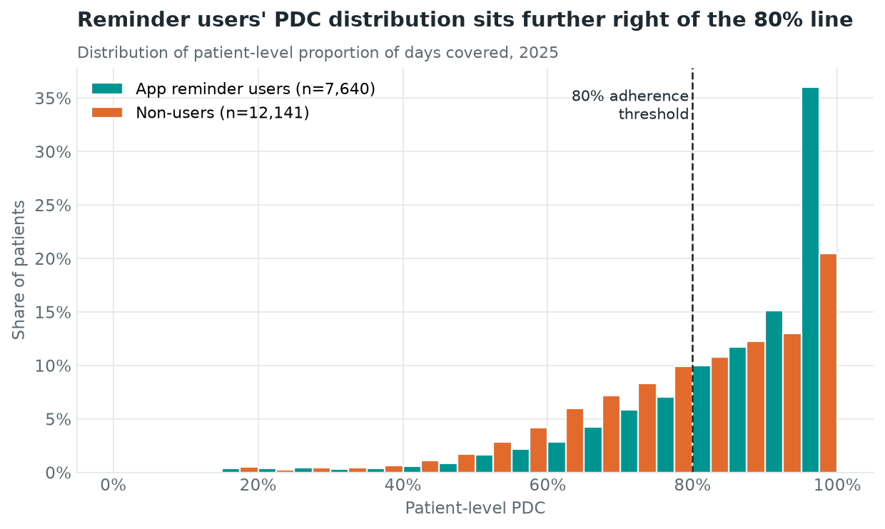
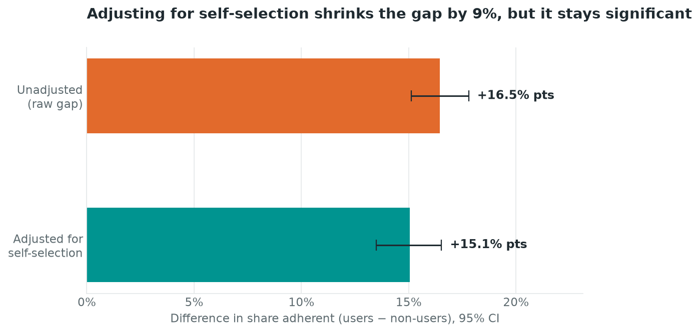
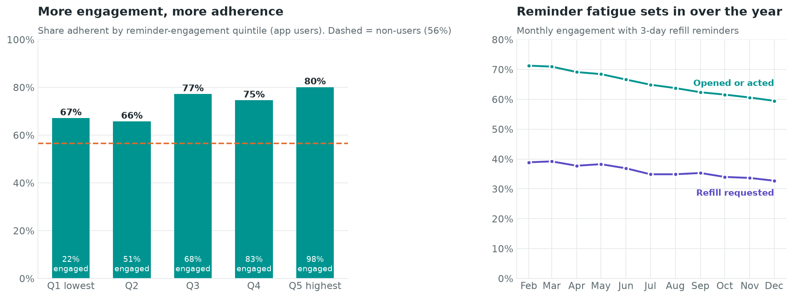
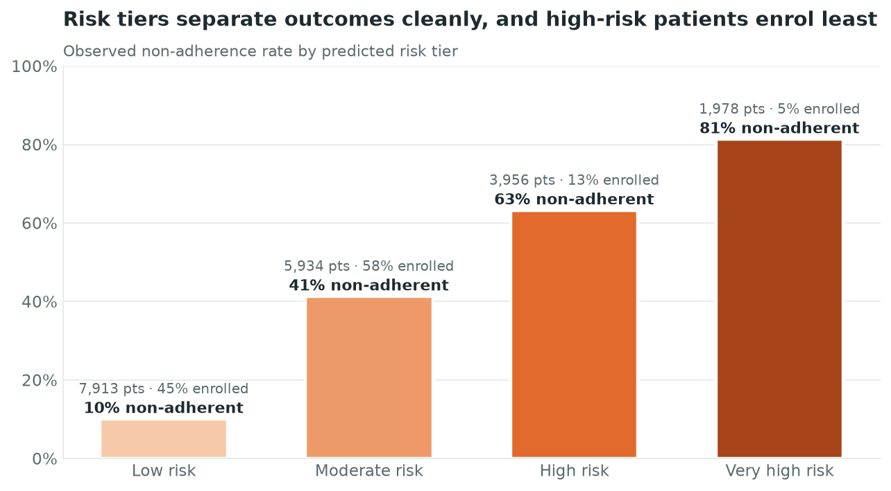

# Project 7 · Medication Adherence & Digital Reminder Impact

> **Do app reminders actually help patients with chronic conditions take their medication, and which app features make the difference?**

This project looks at a patient app's refill-reminder programme the way a digital health analytics team would. We measure adherence with standard pharmacy-claims metrics, test whether reminder users do better, separate the app's effect from who chooses to use it, identify which features carry the effect, and turn the results into a risk-based outreach plan.

| Deliverable | File |
|---|---|
| Analysis notebook (executed, with outputs) | [`medication_adherence_analysis.ipynb`](medication_adherence_analysis.ipynb) |
| Synthetic data generator | [`generate_data.py`](generate_data.py) → `data/` |
| Charts | [`images/`](images/) |
| 10-slide deck (same theme) | [`medication_adherence_deck.pptx`](medication_adherence_deck.pptx) (built by [`deck/build_deck.js`](deck/build_deck.js)) |
| Summary metrics and patient scores | [`outputs/`](outputs/) |

---

## Why this matters for preventive care

Around half of patients with chronic disease do not take maintenance medication as prescribed. Missed statins, antihypertensives and diabetes drugs rarely hurt today. The cost arrives later as strokes, heart attacks, admissions and COPD exacerbations that could have been prevented. For payers and providers, adherence to these three drug classes also feeds directly into **CMS Star Ratings** through the Pharmacy Quality Alliance (PQA) PDC measures.

Adherence is therefore one of the few preventive-care levers that a consumer app can move directly. The patient's phone is already present at the moment that matters: when a refill is due or a dose is missed. The analytics question is whether that presence changes behaviour, for whom, and through which features.

---

## Data (synthetic, 20,000 patients)

`generate_data.py` produces five linked tables for the 2025 measurement year. They are seeded and reproducible, and stored as `.csv.gz`.

| Table | Rows | Contents |
|---|---:|---|
| `patients` | 20,000 | Age, sex, region, urbanicity, insurance; hypertension, type 2 diabetes, hyperlipidemia, COPD, heart failure; depression; prior hospitalisations; smartphone ownership; digital-literacy score; monthly copay |
| `app_enrollment` | 7,707 | Enrolment date, reminder channel (push/SMS), preferred reminder time, daily dose reminders on/off, caregiver alerts on/off |
| `prescriptions` | 33,655 | Drug class per condition (statin, ACE/ARB/CCB, metformin, SGLT2, DPP-4, inhaler, beta blocker), start date, 30/90-day supply, retail vs mail order |
| `refills` | 213,422 | Claims-style fill records: fill date, days' supply, quantity |
| `reminder_logs` | 100,796 | Every refill reminder sent (3-day pre-due and overdue follow-up) with channel, outcome (refill requested, opened, snoozed, dismissed, ignored) and response time |

The data-generating process includes the problems that make this analysis hard in real life:

* **Self-selection.** Younger, digitally literate smartphone owners enrol more often, and digital literacy also predicts adherence.
* **Engagement varies.** The reminder only helps when the patient acts on it.
* **Reminder fatigue.** Engagement decays over the year.
* **Feature effects.** Push vs SMS, dose reminders and caregiver alerts each change engagement to a different degree.
* **Realistic adherence drivers.** Copay, depression, Medicaid/self-pay coverage, 90-day supply and drug class (statins and inhalers are the worst).

---

## Method

1. **Adherence metrics.**
   * **PDC (proportion of days covered)** follows the PQA method: coverage runs from each prescription's index fill to 31 December, early refills are shifted forward rather than double-counted, and a prescription needs at least two fills to count.
   * **MPR (medication possession ratio)** is days' supply dispensed divided by days in the period. It is reported raw and capped at 1.0 to show why it overstates adherence.
   * At patient level we use mean PDC, and a patient is *adherent* when it is at least 80%.
2. **Users vs non-users.**
   * Welch's t-test and Mann-Whitney U on PDC; chi-square on the adherent rate.
   * Effect sizes: Cohen's d, rank-biserial r, risk difference and relative risk.
   * Results stratified by condition.
3. **Causal adjustment.** A propensity-score model on 19 baseline covariates, then **overlap weighting**, which avoids the extreme weights classic IPTW produces when almost every user owns a smartphone. We check balance with a Love plot and report a bootstrap 95% CI. A covariate-adjusted logistic regression serves as a second check.
4. **Engagement and features.** The reminder funnel, monthly engagement (fatigue), a dose-response curve by engagement quintile, and adjusted odds ratios for push vs SMS, dose reminders and caregiver alerts.
5. **Segmentation.** Observed segments (adherent, partially adherent, non-adherent) with profiles, plus capacity-based **predicted risk tiers** (bottom 40% / next 30% / next 20% / top 10%) from out-of-fold model scores.
6. **Prediction.** Logistic regression vs gradient boosting, using baseline information only, so there is no leakage from refill history. We report 5-fold CV AUC, hold-out ROC, PR-AUC, calibration and odds-ratio drivers.

---

## Key results

| Metric | Value |
|---|---|
| Patients adherent (mean PDC ≥ 80%) | **62.8%** |
| Adherent on *every* maintenance drug | 54.5% |
| Mean PDC / mean raw MPR | 82.2% / 89.6% |
| Patients who look adherent on capped MPR but fail on PDC | 6.5% |
| Adherent: reminder users vs non-users | **72.9% vs 56.4%** (+16.5 pts, 95% CI 15.1–17.8; RR 1.29; χ² = 543, p < 0.001) |
| Adjusted for self-selection (overlap weighting) | **+15.1 pts** (95% CI 13.5–16.5); mean PDC +5.2 pts |
| Adherence, lowest vs highest engagement quintile | 67% → 80% |
| Engagement with refill reminders, Feb → Dec | 71% → 59% (fatigue) |
| Daily dose reminders / caregiver alerts (adjusted OR) | 1.29 (1.14–1.46) / 1.23 (1.02–1.47) |
| Push vs SMS (adjusted OR) | 1.12 (0.98–1.29), not significant |
| Model hold-out ROC AUC (logistic ≈ gradient boosting) | **0.82** |
| Non-adherence in Low → Very high risk tier | 10% → 41% → 63% → 81% |
| App enrolment in Low → Very high risk tier | 45% → 58% → 13% → **5%** |






The notebook contains all 11 charts, including covariate balance, feature odds ratios, segment profiles, ROC and calibration, and model drivers.

---

## What the app features tell us about improving preventive care

**1. Reminders work, but only when patients act on them.**
Enrolment alone is a weak signal. The effect rises with engagement: patients who act on almost every reminder reach 80% adherence, while the least engaged users do little better than non-users. The product KPI should be **engaged reminders** (opened or refill requested) rather than downloads or opt-ins, and PDC should be the outcome metric.

**2. Most of the raw effect is real, but not all of it.**
App users differ from non-users: they are younger, more digital and more likely to own smartphones. Adjusting for those differences shrinks the gap by about a tenth, and the remaining effect is still large and clinically meaningful. Across 10,000 non-users, +15 pts means roughly **1,500 more patients reaching the Star Ratings adherence threshold**. Weighting only handles *observed* confounding, so the next step is a **randomised or stepped-wedge rollout** to confirm causality.

**3. Features that build a routine beat delivery channel.**
Daily dose reminders turn a monthly event into a daily habit, and caregiver alerts add a second person who can notice a missed dose. Both show significant, independent lift. Push vs SMS makes little difference. *Recommendation:* make dose reminders and caregiver invitations **default-on (opt-out) during onboarding**, and keep SMS as a fallback for patients without smartphones rather than pushing everyone to the app.

**4. Reminder fatigue erodes impact over time.**
Engagement falls about 12 points over the year. *Recommendations:*
* rotate message content, for example showing the patient's own adherence streak or naming the benefit of the drug;
* learn the best send time for each patient;
* when two reminders in a row are ignored, **escalate from automated to human outreach** (pharmacist or care-manager call) instead of sending more of the same.

**5. The patients who need the app most are the least likely to have it.**
The two highest-risk tiers have only 5–13% enrolment, against 45–58% in the lower tiers. Organic app growth makes this gap *wider*. *Recommendation:* use the day-one risk model to target **assisted enrolment** at the pharmacy counter, at discharge and in care-management calls for the ~5,300 High / Very high-risk patients not enrolled. Pair it with **copay support** and **90-day or mail-order conversion**, which was the strongest protective factor in the model.

**6. Measure the way the payer measures.**
MPR flatters adherence. Using PDC ≥ 80% keeps product dashboards aligned with Star Ratings and value-based contracts, so any app improvement translates directly into quality-measure performance.

### Suggested product roadmap

| Priority | Initiative | Success metric |
|---|---|---|
| Now | Default-on dose reminders and caregiver invites | Share of users with features on; engaged-reminder rate |
| Now | Risk-tier targeting for assisted enrolment | Enrolment in High / Very high tiers |
| Next | Fatigue controls: content rotation, adaptive timing, human escalation | Month-12 engagement vs month-1 |
| Next | In-app 90-day / mail-order switch and copay-assistance prompts | 90-day supply share; PDC in the high-copay segment |
| Later | Randomised rollout to confirm the causal effect | ITT difference in PDC ≥ 80% |

---

## Limitations

* The data are synthetic. Effect sizes reflect the simulation's assumptions and are not real-world estimates.
* Refill-based adherence measures *possession*, not ingestion.
* Propensity weighting cannot remove unmeasured confounding such as health motivation.
* The risk model uses baseline features only by design. Adding early refill behaviour would improve it, but would require re-defining the outcome window to avoid leakage.

---

## Reproduce

```bash
cd 07-medication-adherence-python
pip install -r requirements.txt
python generate_data.py                       # writes data/*.csv.gz (≈30 s)
jupyter nbconvert --to notebook --execute --inplace medication_adherence_analysis.ipynb
# optional: rebuild the deck from outputs/summary_metrics.json
cd deck && npm install && node build_deck.js
```

### Visual theme
Charts and slides share one palette: teal `#009490` for reminder users, orange `#E26A2C` for non-users and risk, violet `#5B4BC4` for a third series, and deep teal `#0B2E33` for title slides. Slides use Cambria headings with Calibri body text. The categorical colours were checked for colour-vision-deficiency separation, and every chart is also directly labelled.
